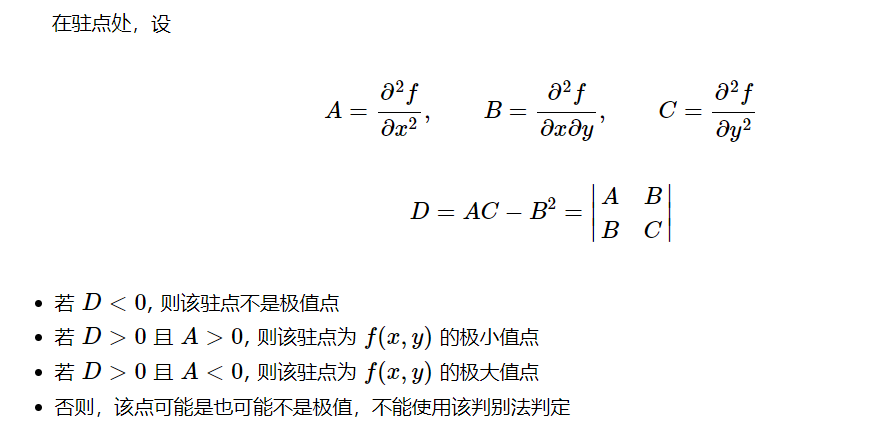

## 罗尔中值定理

通常称导数等于零的点为函数的驻点（或稳定点，临界点）
罗尔定理如果函数f(x)满足
(1)在闭区间[a,b]上连续；
(2)在开区间(a,b)内可导；
(3)在区间端点处的函数值相等，即f(a)=f(b),
那么在(a,b)内至少有一点尔姆西隆（a<5<b),使得f'(尔姆西隆)=0.

## 拉格朗日中值定理

罗尔定理中条件 ![[公式]](https://www.zhihu.com/equation?tex=f%28a%29%3Df%28b%EF%BC%89) 的特殊性，使其应用受到了很大的限制，如果取消此条件，其他条件保留，相应的改变结论，便得到了拉格朗日中值定理。它的几何意义如图，

更多有趣的解释可以参考下文

**如果函数 ![[公式]](https://www.zhihu.com/equation?tex=f%28x%29) 满足**

**(1)在闭区间 ![[公式]](https://www.zhihu.com/equation?tex=%5Ba%2Cb%5D) 上连续；**

**(2)在开区间 ![[公式]](https://www.zhihu.com/equation?tex=%28a%2Cb%29) 上可导；**

**那么在 ![[公式]](https://www.zhihu.com/equation?tex=%28a%2Cb%29) 内至少有一点 ![[公式]](https://www.zhihu.com/equation?tex=%5Cxi+%28a%3C%5Cxi%3Cb%29) ,使等式 ![[公式]](https://www.zhihu.com/equation?tex=f%28b%29-f%28a%29%3Df%5E%7B%27%7D%28%5Cxi%29%28b-a%29) 成立。**

可以使用罗尔中值定理来证明拉格朗日中值定理，构造函数：h(x)=f(x)-L(x)，L(x)是直线，h(x)直线与曲线之间的距离。

## 柯西中值定理

设函数 ![[公式]](https://www.zhihu.com/equation?tex=g%28x%29%E5%92%8Cf%28x%29%E5%9C%A8%E9%97%AD%E5%8C%BA%E9%97%B4%5Ba%2C+b%5D%E5%86%85%E8%BF%9E%E7%BB%AD) ，

在开区间(a, b)内可导，

且 ![[公式]](https://www.zhihu.com/equation?tex=%5Cforall+x%5Cin%28a%2C+b%29%2C++g%27%28x%29%5Cne0)

则存在 ![[公式]](https://www.zhihu.com/equation?tex=%5Cxi%5Cin%28a%2C+b%29%2C+%E6%9C%89%5Cfrac%7Bf%28b%29-f%28a%29%7D%7Bg%28b%29-g%28a%29%7D%3D%5Cfrac%7Bf%27%28%5Cxi%29%7D%7Bg%27%28%5Cxi%29%7D)

## 和差化积公式

可以用口诀来简单记忆：

正加正，正在前，余加余，余并肩

正减正，余在前，余减余，负正弦

## 二元函数微分学

求极限的五种方法：

**1. 利用定义验证极限为常数**

**2. 利用二元连续函数的性质求之，就是直接把点带进去算**

**命题**：若函数 ![[公式]](https://www.zhihu.com/equation?tex=f%28x%2C+y%29) 在点 ![[公式]](https://www.zhihu.com/equation?tex=%5Cleft%28x_%7B0%7D%2C+y_%7B0%7D%5Cright%29) 处连续,则

**3. 两个重要极限**

![[公式]](https://www.zhihu.com/equation?tex=%5Clim+_%7Bu%28x%2C+y%29+%5Crightarrow+0%7D+%5Cfrac%7B%5Csin+u%28x%2C+y%29%7D%7Bu%28x%2C+y%29%7D%3D1%2C+%5Clim+_%7Bu%28x%2C+y%29+%5Crightarrow+0%7D%5B1%2Bu%28x%2C+y%29%5D%5E%7B%5Cfrac%7B1%7D%7Bu%28x+y%29%7D%7D%3De+%5C%5C)

**4. 用等价无穷小代换求之**

**例【589】求极限:**

![[公式]](https://www.zhihu.com/equation?tex=%5Clim+_%7B%28x%2C+y%29+%5Crightarrow%280%2C0%29%7D+%5Cfrac%7B%5Csqrt%7Bx%5E%7B2%7D%2By%5E%7B2%7D%7D-%5Csin+%5Csqrt%7Bx%5E%7B2%7D%2By%5E%7B2%7D%7D%7D%7B%5Cleft%28x%5E%7B2%7D%2By%5E%7B2%7D%5Cright%29%5E%7B3+%2F+2%7D%7D+%5C%5C)

解：令 ![[公式]](https://www.zhihu.com/equation?tex=%5Csqrt%7Bx%5E%7B2%7D%2By%5E%7B2%7D%7D%3Dt), 则 ![[公式]](https://www.zhihu.com/equation?tex=%28x%2C+y%29+%5Crightarrow%280%2C0%29) 时,有 ![[公式]](https://www.zhihu.com/equation?tex=t+%5Crightarrow+0), 因而

![[公式]](https://www.zhihu.com/equation?tex=%5Ctext+%7B+%E5%8E%9F%E5%BC%8F+%7D%3D%5Clim+_%7Bt+%5Crightarrow+0%7D+%5Cfrac%7Bt-%5Csin+t%7D%7Bt%5E%7B3%7D%7D%3D%5Clim+_%7Bt+%5Crightarrow+0%7D+%5Cfrac%7Bt%5E%7B3%7D%7D%7B6+t%5E%7B3%7D%7D%3D%5Cfrac%7B1%7D%7B6%7D+%5C%5C)

**5. 用夹逼准则求之**

例【591】 求

![[公式]](https://www.zhihu.com/equation?tex=%5Clim+_%7B%28x%2C+y%29+%5Crightarrow%28%2B%5Cinfty%2C%2B%5Cinfty%29%7D%5Cleft%28%5Cfrac%7Bx+y%7D%7Bx%5E%7B2%7D%2By%5E%7B2%7D%7D%5Cright%29%5E%7Bx%7D+%5C%5C)

解：因 ![[公式]](https://www.zhihu.com/equation?tex=x%5E%7B2%7D%2By%5E%7B2%7D+%5Cgeq+2%7Cx%7C%7Cy%7C),故

![[公式]](https://www.zhihu.com/equation?tex=0+%5Cleq%5Cleft%7C%5Cfrac%7Bx+y%7D%7Bx%5E%7B2%7D%2By%5E%7B2%7D%7D%5Cright%7C+%5Cleq+%5Cfrac%7B1%7D%7B2%7D+%5C%5C)

从而当 ![[公式]](https://www.zhihu.com/equation?tex=x%3E0%2C+y%3E0) 时,有

![[公式]](https://www.zhihu.com/equation?tex=0+%5Cleq%5Cleft%28%5Cfrac%7Bx+y%7D%7Bx%5E%7B2%7D%2By%5E%7B2%7D%7D%5Cright%29%5E%7Bx%7D+%5Cleq%5Cleft%28%5Cfrac%7B1%7D%7B2%7D%5Cright%29%5E%7Bx%7D+%5C%5C)

由于

![[公式]](https://www.zhihu.com/equation?tex=%5Clim+_%7B%28x%2C+y%29+%5Crightarrow%28%2B%5Cinfty%2C%2B%5Cinfty%29%7D%5Cleft%28%5Cfrac%7B1%7D%7B2%7D%5Cright%29%5E%7Bx%7D%3D0+%5C%5C)

夹逼准则得到原式= 0 .

[微积分：七、多元函数微分学 - 知乎 (zhihu.com)](https://zhuanlan.zhihu.com/p/348455980)

## 可微、可导、连续

对于一元函数有，可微<=>可导=>连续，**一元的可微就是可导**。

二阶可导只能说明一阶导连续，二阶导函数不一定连续，所以不能将0直接带入。

**对于多元函数，不存在可导的概念，只有偏导数存在。**函数在某处可微等价于在该处沿**所有方向的方向导数**存在，仅仅保证偏导数存在不一定可微，因此有：可微=>偏导数存在=>连续。

可导与连续的关系：可导必连续，连续不一定可导；

偏导数的**几何意义**就是：

 “偏导数反映的是函数沿**坐标轴正方向**的**变化率**”

## 二元函数的极值

## **极值点判别法（充分非必要条件）**

先让偏导为0（对x，对y），然后求A，B，C，D（带入让偏导为0的x、y）。

## 判断极值_拐点的三个充要条件以及一个必要

[ 判断极值_拐点的三个充要条件以及一个必要_拐点的三个充分条件](https://blog.csdn.net/qq_43141726/article/details/105223525)

拐点是指曲线凹弧、凸弧的分界点

## 曲线积分、曲面积分

最早了解的积分的概念中，积分范围是数轴上的一个**区间**。然后推广到二重积分，其积分范围是平面内的一个**区域**。这是**从线到面**的推广。
接着曲线积分是把积分范围从仅沿数轴的区间（线段）推广到**光滑曲线弧**。而曲面积分是把积分范围从平面内的区域推广到**曲面区域**。这是**从直到曲**的推广。

[曲线积分的计算方法如何来记忆 - 知乎 (zhihu.com)](https://zhuanlan.zhihu.com/p/36053889)：重要的方法，直接将曲线的方程带入，确定积分的上下限。

**第一类曲线积分计算方法：**

（1）记住公式

∫Lf(x,y)ds=∫Lf(x,y)(dx)2+(dy)2

（2）直接代入曲线方程。该求微分求微分，该确定积分上下限就确定积分上下限即可。

**第二类曲线积分计算方法：**

（1）直接代入曲线方程

（2）确定积分上下限直接计算即可。

## 三重积分的球坐标计算方法

[(1条消息) 高等数学学习笔记——第八十讲——球坐标下三重积分的计算_预见未来to50的博客-CSDN博客_球面坐标计算三重积分](https://blog.csdn.net/hpdlzu80100/article/details/105984710)

## 三重积分的柱坐标计算方法

[(1条消息) 高等数学学习笔记——第七十九讲——柱坐标下三重积分的计算_预见未来to50的博客-CSDN博客_柱坐标三重积分](https://blog.csdn.net/hpdlzu80100/article/details/105961700?ops_request_misc=%257B%2522request%255Fid%2522%253A%2522166251129016782395384418%2522%252C%2522scm%2522%253A%252220140713.130102334.pc%255Fblog.%2522%257D&request_id=166251129016782395384418&biz_id=0&utm_medium=distribute.pc_search_result.none-task-blog-2~blog~first_rank_ecpm_v1~rank_v31_ecpm-1-105961700-null-null.nonecase&utm_term=%E6%9F%B1%E5%9D%90%E6%A0%87&spm=1018.2226.3001.4450)

## 积分区域的对称性

[二重积分](https://3g.163.com/dy/article/GNEG2RSG0542811M.html?spss=adap_pc)

## 二重积分的换元

https://zhuanlan.zhihu.com/p/65953562

## 微分方程

通解：含有常数的个数等于微分方程的阶数

1、可分离变量的微分方程：g(y)dy=f(x)dx，两边积分。

2、齐次方程：u=y/x.

3、常系数线性齐次方程：写特征方程

## 常见的泰勒展开式

https://zhuanlan.zhihu.com/p/323446382

https://zhuanlan.zhihu.com/p/313015168

## 对导函数求导什么时候要用公式什么时候用定义

分段函数的分段点用定义求，连续区间内用导数公式。无定义点，间断点和尖点都不存在导数。另外，导数在一点的符号并不能判断该点任何邻域(邻域存在)内函数的单调性。

